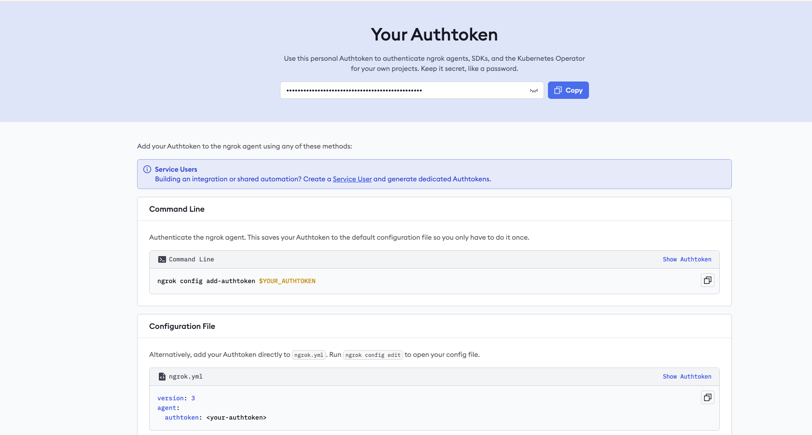
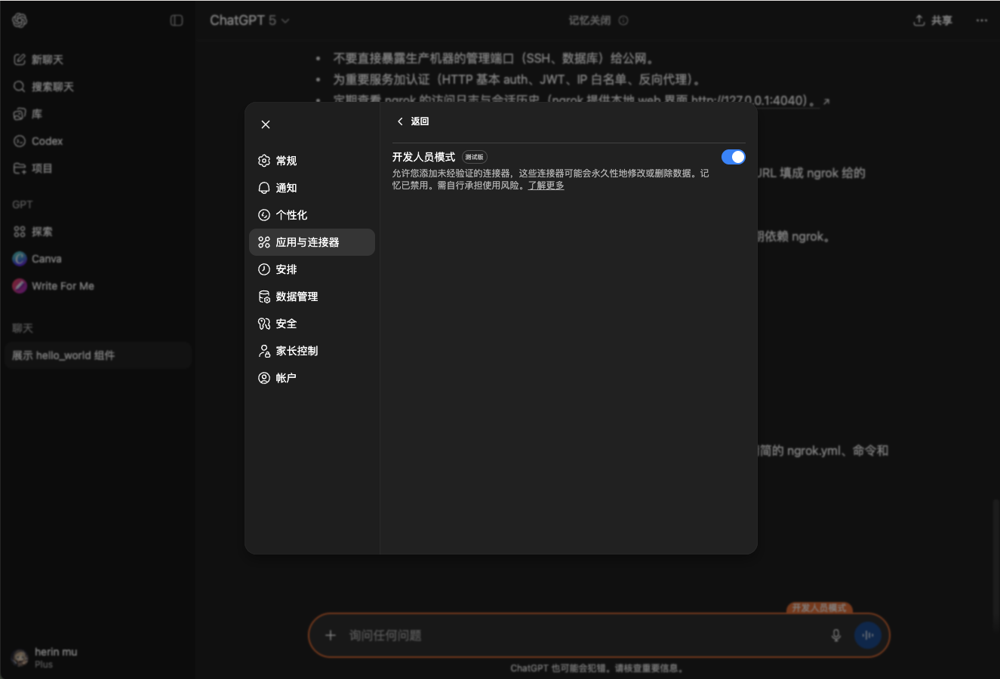
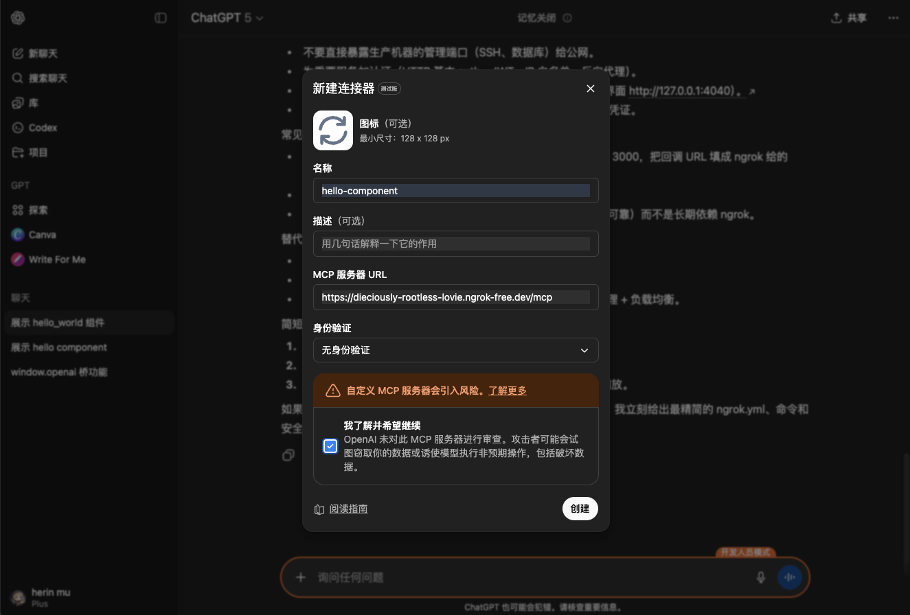
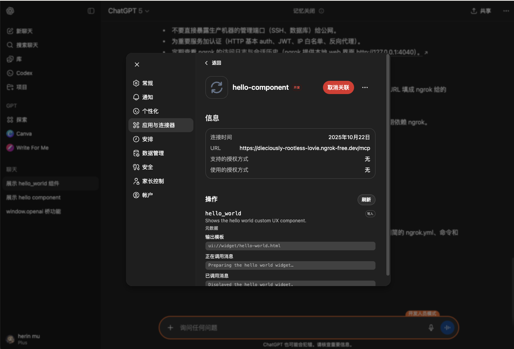
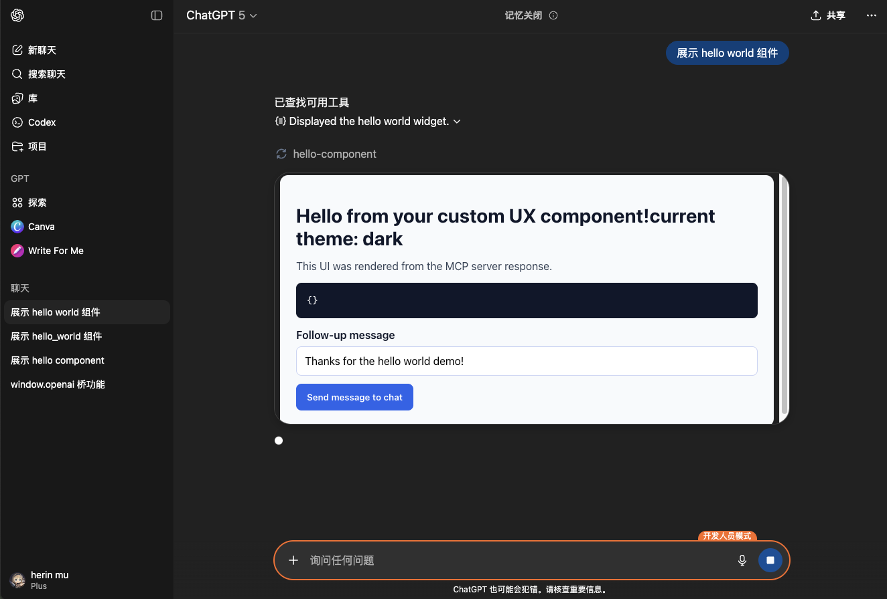

# 测试一下如何跑起来 OpenAI Custom UX 和 SDK

1. chatgpt 的 mcp 链接仅能链接公网资源。所以需要用 ngrok 做内网穿透，需要先准备一个 Token。 https://dashboard.ngrok.com/get-started/your-authtoken

2. 把这个 Token 加到本机的环境变量。`export NGROK_AUTHTOKEN=34PQ*******************4k1xY`

3. 直接 `pnpm i && pnpm start:dev` 的到 ngrok 的 mcp server url。

4. 在 chatgpt 开启 dev 模式。（只有 dev 模式可以添加自己的 mcp server）

5. 添加 mcp server connection，地址为 ngrok 的公网地址。

创建后，应该正常展示这个 server 对应的元数据、工具等。

6. 对话里面正常和模型对话，即可干正常唤起 App。

